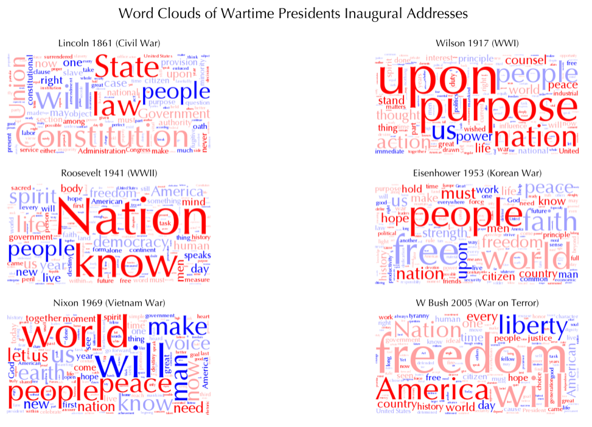
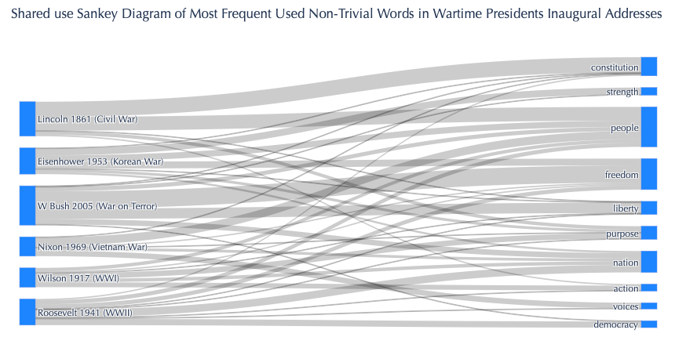
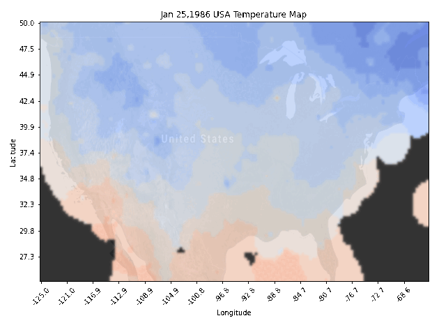

Please see my featured projects:

## [Project 1: Endangered Animal Database Construction and Analysis](https://github.com/thclough/endangered_db)
* Created a database to integrate various data sources on endangered species trade
* Wrangled big, messy data on trades for database compatibility and easier analysis
* Wrote queries on the database (used CTE's, staging tables, joins, window functions, etc.) and created visualizations
* Created an interactive animated graph app giving overview of the data and deployed on render
* Theorized use cases and performed appropriate analysis

## [Project 2: Wartime Presidents Inaugural Addresses: NLP Analysis](https://github.com/thclough/inaugural_address_analysis)
* Processed text from selected inaugural addresses using regex
* Generated word clouds for each speech
* Visualized sentiment scores for comparison
* Create sankey diagram to show common usage of non-trivial words

 

## [Project 3: Challenger Incident Analysis](https://github.com/thclough/challenger_incident_analysis)
* Calculated inverse distance-weighted temperatures from weather station data to investingate the *Challenger* Shuttle Disaster
* Visualized temperatures across United States on a given day using numpy array meshgrids and overlaying on a US map
* Integrated visualizations into a story of the incident

